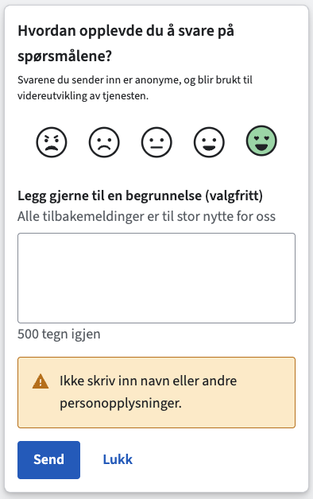

# Flexjar Widget

This workspace hosts `@navikt/flexjar-widget` – the React-based Flexjar survey
widget. The package bundles the dock UI, hooks, and shared types you need to
collect feedback with a configurable question set.

## Quick Start

```tsx
import "@navikt/ds-css/darkside";
import "@navikt/flexjar-widget/styles.css";
import { FlexJarDock } from "@navikt/flexjar-widget";

// Minimal example - just 3 props needed
<FlexJarDock
  feedbackId="my-app-feedback"
  survey={{
    questions: [
      { id: "rating", type: "rating", prompt: "Hvordan var opplevelsen?", required: true },
      { id: "main", type: "text", prompt: "Hva kan vi forbedre?" },
    ],
  }}
  transport={{
    submit: async (submission) => {
      await fetch("/api/feedback", {
        method: "POST",
        body: JSON.stringify(submission.transportPayload),
      });
    },
  }}
/>
```

## Getting started

1. Configure npm to read from GitHub Packages if you have not already:

   ```sh
   npm config set @navikt:registry https://npm.pkg.github.com
   ```

   Provide an auth token with `read:packages` scope via
   `npm login --registry=https://npm.pkg.github.com` or by exporting
   `NODE_AUTH_TOKEN` in CI.

2. Install the widget along with its peer dependencies:

   ```sh
   npm install @navikt/flexjar-widget react react-dom @navikt/ds-react @navikt/ds-css
   ```

   Include the Aksel Darkside design system styles and the widget stylesheet once in your
   app entry point:

   ```ts
   import "@navikt/ds-css/darkside";
   import "@navikt/flexjar-widget/styles.css";
   ```

   > Using a global CSS file instead of JavaScript imports? Add
   > `@import "@navikt/flexjar-widget/styles.css";` below the Aksel import.

3. Ensure you have `@navikt/nav-dekoratoren-moduler` v1.6.0 or later installed:

   ```sh
   npm install @navikt/nav-dekoratoren-moduler@^1.6.0
   ```

4. Follow the usage guide below to describe your survey, wire a transport handler,
   and render the widget entry point that fits your product.

## API Endpoints

Send feedback submissions to the Flexjar backend:

| Environment | URL |
|-------------|-----|
| **Dev** | `https://flexjar-analytics-api.intern.dev.nav.no/api/v2/feedback` |
| **Prod** | `https://flexjar-analytics-api.intern.nav.no/api/v2/feedback` |

### Onboarding your app

To send feedback to the Flexjar API, your app must:

1. **Configure Azure AD** in your `nais.yaml`:
   ```yaml
   azure:
     application:
       enabled: true
   ```

2. **Add outbound access** to the API:
   ```yaml
   accessPolicy:
     outbound:
       rules:
         - application: flexjar-analytics-api
           namespace: team-esyfo
   ```

3. **Request inbound access** – Contact team-esyfo to add your app to the API's inbound policy.

4. **Get an OBO token** for `api://<cluster>.team-esyfo.flexjar-analytics-api/.default` and include it as `Authorization: Bearer <token>`.

### Example transport

```ts
import { getToken, requestAzureOboToken } from "@navikt/oasis";

const transport: FlexJarTransport = {
  async submit(submission) {
    const token = getToken(request);
    const obo = await requestAzureOboToken(
      token,
      "api://prod-gcp.team-esyfo.flexjar-analytics-api/.default"
    );
    
    await fetch("https://flexjar-analytics-api.intern.nav.no/api/v2/feedback", {
      method: "POST",
      headers: {
        "Content-Type": "application/json",
        Authorization: `Bearer ${obo.token}`,
      },
      body: JSON.stringify(submission.transportPayload),
    });
  },
};
```

## Survey Analytics

View collected feedback at:

| Environment | Dashboard URL |
|-------------|---------------|
| **Dev** | https://flexjar-analytics.intern.dev.nav.no |
| **Prod** | https://flexjar-analytics.intern.nav.no |

The dashboard provides:
- Feedback list with filtering by date, rating, text, tags
- Statistics with rating distribution, device breakdown, pathnames
- Top Tasks success rate tracking
- Excel/CSV export

## See it in action



## Describe your survey schema

You can define surveys manually using the `questions` array, or use helper functions for common patterns.

### Option 1: Using Presets (Recommended)

```ts
import { createRatingSurvey, createTopTasksSurvey } from "@navikt/flexjar-widget";

// Standard rating survey
export const ratingSurvey = createRatingSurvey({
    ratingPrompt: "Hvordan var det å bruke oppfølgingsplanen?",
    ratingDescription: "Svarene du sender inn er anonyme.",
    textPrompt: "Hva kan vi forbedre?",
});

// Top Tasks survey
export const topTasksSurvey = createTopTasksSurvey({
    tasks: [
        { value: "apply", label: "Søke om sykepenger" },
        { value: "status", label: "Sjekke status på søknad" },
    ],
    taskPrompt: "Hva prøvde du å gjøre i dag?",
});
```

### Option 2: Manual Configuration

```ts
import { type FlexJarSurveyConfig } from "@navikt/flexjar-widget";

export const survey: FlexJarSurveyConfig = {
    // Optional: gateQuestionId acts as a visibility gate.
    // Follow-up questions are hidden until this question is answered.
    gateQuestionId: "rating",
    questions: [
        {
            id: "rating",
            type: "rating",
            prompt: "Hvordan opplevdes dette?",
            required: true,
        },
        {
            id: "feedback",
            type: "text",
            prompt: "Fortell mer (frivillig)",
            required: false,
        },
    ],
};
```

## FlexJarDock

`FlexJarDock` renders a compact, sticky
panel that lets users answer the rating question immediately and complete the
rest of the form inline—without opening a modal.

```tsx
"use client";

import { FlexJarDock, type FlexJarTransport } from "@navikt/flexjar-widget";
import { survey } from "./survey";

const transport: FlexJarTransport = {
	async submit(submission) {
		await fetch("/api/flexjar", {
			method: "POST",
			headers: { "Content-Type": "application/json" },
			body: JSON.stringify(submission.transportPayload),
		});
	},
};

export const FeedbackDock = () => (
	<FlexJarDock
		feedbackId="oppfolgingsplan"
		survey={survey}
		transport={transport}
		position="bottom-right"
	/>
);
```

## FlexJarDock props

| Prop                 | Type                              | Required | Default             | Description                                                       |
|----------------------|-----------------------------------|----------|---------------------|-------------------------------------------------------------------|
| `position`           | `'bottom-right' \| 'bottom-left'` | No       | `'bottom-right'`    | Which corner of the viewport the dock sticks to.                  |
| `offset`             | `number`                          | No       | `24`                | Pixel distance from the viewport edge.                            |
| `containerClassName` | `string`                          | No       | –                   | Custom class applied to the fixed outer container.                |
| `panelClassName`     | `string`                          | No       | –                   | Custom class applied to the inner panel element.                  |
| `panelBackground`    | `BoxProps['background']`          | No       | `'surface-default'` | Token applied to the dock panel background.                       |
| `panelBorderColor`   | `BoxProps['borderColor']`         | No       | `'border-subtle'`   | Token used for the panel border; set to `undefined` to remove it. |

## Core props

| Prop                     | Type                                                     | Required | Default                                                   | Description                                                                                                                           |
|--------------------------|----------------------------------------------------------|----------|-----------------------------------------------------------|---------------------------------------------------------------------------------------------------------------------------------------|
| `feedbackId`             | `string`                                                 | Yes      | –                                                         | Identifier included with the submission payload and analytics callbacks.                                                              |
| `survey`                 | `FlexJarSurveyConfig`                                    | Yes      | –                                                         | Configuration containing the list of questions and survey type.                                                                       |
| `transport`              | `FlexJarTransport`                                       | Yes      | –                                                         | Implementation responsible for persisting a submission.                                                                               |
| `events`                 | `FlexJarEvents`                                          | No       | –                                                         | Lifecycle callbacks for analytics, validation, and dismissal persistence (see below).                                                 |
| `context`                | `Record<string, unknown>`                                | No       | –                                                         | Extra metadata merged into the submission payload.                                                                                    |
| `title`                  | `string`                                                 | No       | `"Gi tilbakemelding"`                                     | Accessible label for the dock panel; useful when the rating prompt is not self-explanatory.                                           |
| `submitLabel`            | `string`                                                 | No       | `"Send"`                                                  | Text for the primary submit button when idle.                                                                                         |
| `submitPendingLabel`     | `string`                                                 | No       | `"Sender…"`                                               | Text for the primary button while a submission is pending.                                                                            |
| `cancelLabel`            | `string`                                                 | No       | `"Lukk"`                                                  | Text for the secondary cancel button and close icon aria-label.                                                                       |
| `validationErrorMessage` | `string`                                                 | No       | `"Du må svare på spørsmålet."`                            | Message used by question components when required answers are missing.                                                                |
| `transportErrorMessage`  | `string`                                                 | No       | `"Kunne ikke sende tilbakemeldingen. Prøv igjen senere."` | Message displayed when the transport throws.                                                                                          |
| `successTitle`           | `string`                                                 | No       | `"Takk for tilbakemeldingen!"`                            | Title shown after a successful submission.                                                                                            |
| `successBody`            | `React.ReactNode`                                        | No       | `undefined`                                               | Body text in the success view; omitted by default.                                                                                    |
| `successPrimaryLabel`    | `string`                                                 | No       | `"Lukk"`                                                  | Label for the button in the success view.                                                                                             |
| `renderQuestion`         | `(props: FlexJarRenderQuestionProps) => React.ReactNode` | No       | –                                                         | Custom renderer if you want to override the default question components.                                                              |
| `resetOnClose`           | `boolean`                                                | No       | `true`                                                    | Reset answers when the dock closes.                                                                                                   |
| `autoCloseOnSuccess`     | `boolean`                                                | No       | `false`                                                   | Close the dock automatically after a successful submission.                                                                           |
| `successCloseDelayMs`    | `number`                                                 | No       | `1600`                                                    | Delay (ms) before auto-closing when `autoCloseOnSuccess` is enabled.                                                                  |
| `dismissCooldownDays`    | `number`                                                 | No       | `30`                                                      | Number of days before the dock can reappear after being dismissed (requires surveys consent and `flexjar-*` in allowed storage list). |
| `initialOpen`            | `boolean`                                                | No       | `true`                                                    | Whether the dock should be open by default. When persistence is unavailable, this controls the initial state.                         |
| `showPersonalDataNotice` | `boolean`                                                | No       | `true`                                                    | Toggle the default personal-data warning beneath the form.                                                                            |
| `personalDataNotice`     | `React.ReactNode`                                        | No       | Default warning element                                   | Custom content for the personal-data warning.                                                                                         |

## Customise the experience

- **Always-on feedback**: `FlexJarDock` keeps the survey visible and can reveal follow-ups once a "gate" question is answered.
- **Copy & layout**: customise `title`, `submitLabel`, `cancelLabel`, `successTitle`, and `personalDataNotice` to match
  your product language.
- **Events**: pass an `events` object (see `FlexJarEvents`) to react to lifecycle hooks like `onViewDock`,
  `onSubmitSuccess`, validation failures, or dismissal persistence issues via `onDismissalPersistFailed`.
- **Success handling**: enable `autoCloseOnSuccess` and tune `successCloseDelayMs` if you want the dock to close
  automatically after feedback is sent.
- **Custom rendering**: provide `renderQuestion` for advanced layouts while keeping accessibility and validation wiring
  from `useFlexJar`.

Flexjar’s backend generally expects a `feedbackId` plus answers keyed by their question IDs.
Core questions in presets use standard IDs (e.g., `rating`, `feedback`, `task`), but you can use any IDs you like.

Every call to your `transport.submit` handler receives a `submission` object with a ready-to-send `transportPayload`.
The widget enriches the payload with the human-readable question text so downstream logs keep answers and prompts
together:

```ts
submission.transportPayload satisfies {
	feedbackId: string;
	feedbackId: string;
	[questionId: string]: string | number | string[];
	[questionIdWithPrefix: `question__${string}`]: string;
};
```

The extra keys follow the pattern `question__<questionId>` and contain the exact prompt that was rendered. Core
- Questions use their configured IDs for both the value and `question__` metadata.

Send that payload directly to the Flexjar backend, or transform it further if you need to enrich the request.

The packages ship with React (`>=18`) and `@navikt/aksel` as peer dependencies. Consumers stay in full control of
network transport, analytics, and question configuration.

## FlexJarSurveyConfig

| Field               | Type                        | Required | Description                                                                                                                                                             |
|---------------------|-----------------------------|----------|-------------------------------------------------------------------------------------------------------------------------------------------------------------------------|
| `questions`         | `FlexJarQuestion[]`         | Yes      | Array of questions to display in order.                                                         |
| `gateQuestionId`    | `string`                    | No       | ID of the question that gates visibility of subsequent questions.                               |
| `type`              | `SurveyType`                | No       | `"rating" \| "topTasks" \| "custom"`. Used for analytics classification. Defaults to `custom`.  |

## Persistence behavior

The widget **always renders** regardless of consent status. Consent only affects
localStorage persistence:

**With surveys consent granted**:

- Dismissal state persists across page reloads using `localStorage`
- Storage is managed via `@navikt/nav-dekoratoren-moduler`
- Storage key format: `flexjar-dismissed-${feedbackId}`
- The dock will reappear after the configured cooldown period (see `dismissCooldownDays`)
- Requires the `flexjar-*` pattern in the decorator's allowed storage list

**Without surveys consent**:

- Widget still renders normally
- No localStorage persistence
- State resets on page reload
- The dock respects `initialOpen` prop on every page load

**When storage key is not in allowed list**:

- Widget renders normally
- Behavior same as without consent (no persistence)
- In development mode, console logs explain why persistence is unavailable

<details>
<summary><strong>Flexjar-widget: Internal developer documentation</strong></summary>

### Work on the widget locally

```sh
npm install
npm run build
```

### Publish to GitHub Packages

1. **Prepare the workspace**
    - Ensure you are on the branch you want to release from (typically `main`).
    - Step into the package folder: `cd packages/widget` before running any version or publish commands.
2. **Authenticate (one-time setup per machine)**
    - Create a personal access token with `write:packages`, `read:packages`, and `repo` scopes.
    - Store it locally: `npm config set //npm.pkg.github.com/:_authToken=<TOKEN>` *(or export `NODE_AUTH_TOKEN=<TOKEN>`
      in CI pipelines).*
3. **Choose the version number**
    - We follow [Semantic Versioning](https://semver.org/): `MAJOR.MINOR.PATCH`.
        - Bug fix only → `npm version patch`
        - Backwards-compatible feature → `npm version minor`
        - Breaking change → `npm version major`
    - `npm version` updates `package.json`, generates a git tag, and commits the bump for you.
4. **Document the release**
    - Update `CHANGELOG.md` with a short summary of the changes going out.
    - Stage the changelog and version bump: `git add package.json package-lock.json CHANGELOG.md`.
5. **Verify before publishing**
    - From the repo root: `npm run lint`, `npm run test`, `npm run build`.
6. **Publish**
    - Still inside `packages/widget`: `npm publish --registry=https://npm.pkg.github.com`.
    - Push the release commit and tag to GitHub: `git push && git push --tags`.

The package exposes the dock UI, question components, hooks, and types from the default entry (
`@navikt/flexjar-widget`).

</details>
