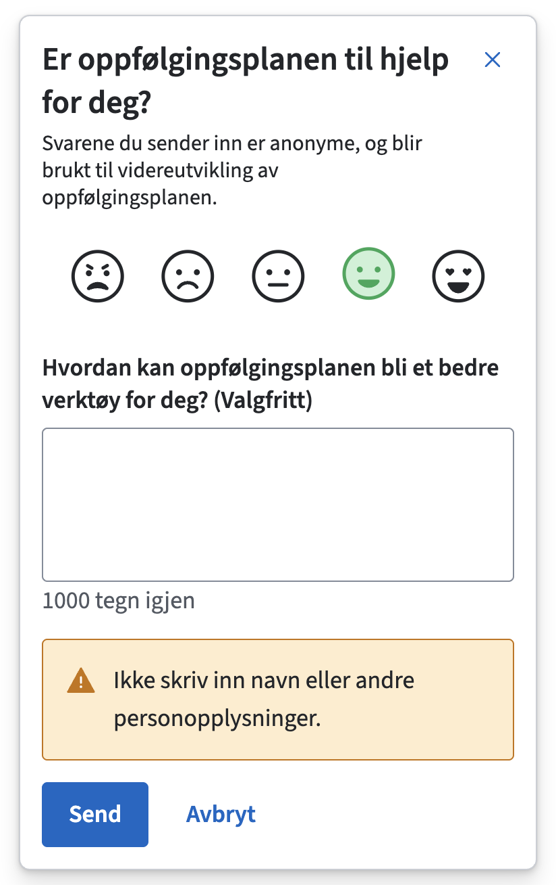

# Flexjar Widget

This workspace hosts `@navikt/flexjar-widget` – the React-based Flexjar survey
widget. The package bundles the dock UI, hooks, and shared types you need to
collect feedback with a configurable question set.

## Getting started

1. Configure npm to read from GitHub Packages if you have not already:

	```sh
	npm config set @navikt:registry https://npm.pkg.github.com
	```

	Provide an auth token with `read:packages` scope via
	`npm login --registry=https://npm.pkg.github.com` or by exporting
	`NODE_AUTH_TOKEN` in CI.

2. Install the widget along with its peer dependencies:

	```sh
	npm install @navikt/flexjar-widget react react-dom @navikt/ds-react
	```

	Include the Aksel design system styles and the widget stylesheet once in your
	app entry point:

	```ts
	import "@navikt/ds-css";
	import "@navikt/flexjar-widget/styles.css";
	```

	> Using a global CSS file instead of JavaScript imports? Add
	> `@import "@navikt/flexjar-widget/styles.css";` below the Aksel import.

3. Follow the usage guide below to describe your survey, wire a transport handler,
	and render the widget entry point that fits your product.

### See it in action



### Describe your survey schema

Most teams start by extracting the shared survey configuration to
`components/flexjar/survey.ts` so it can be imported from any entry point:

```ts
import {
	type FlexJarMainQuestion,
	type FlexJarRatingQuestion,
	type FlexJarSurveyConfig,
} from "@navikt/flexjar-widget";

const ratingQuestion: FlexJarRatingQuestion = {
	type: "rating",
	prompt: "Hvordan var det å bruke oppfølgingsplanen?",
	description:
		"Svarene du sender inn er anonyme, og blir brukt til videreutvikling av oppfølgingsplanen.",
};

const mainQuestion: FlexJarMainQuestion = {
	type: "text",
	prompt:
		"Opplever du at oppfølgingsplanen er et nyttig verktøy for å følge opp den ansatte?",
	minRows: 3,
	maxLength: 500,
	// required defaults to true; set required: false to allow skipping the main question.
};

export const survey: FlexJarSurveyConfig = {
	rating: ratingQuestion,
	mainQuestion,
};
```

### FlexJarDock

Need the survey available at all times? `FlexJarDock` renders a compact, sticky
panel that lets users answer the rating question immediately and complete the
rest of the form inline—without opening a modal. The dock is the default entry
point for Flexjar.

```tsx
"use client";

import { FlexJarDock, type FlexJarTransport } from "@navikt/flexjar-widget";
import { survey } from "./survey";

const transport: FlexJarTransport = {
	async submit(submission) {
		await fetch("/api/flexjar", {
			method: "POST",
			headers: { "Content-Type": "application/json" },
			body: JSON.stringify(submission.transportPayload),
		});
	},
};

export const FeedbackDock = () => (
	<FlexJarDock
		feedbackId="oppfolgingsplan"
		survey={survey}
		transport={transport}
		position="bottom-right"
	/>
);
```

`FlexJarDock` exposes the core survey and copy controls alongside a few dock-specific layout options:

- `position`: stick to `"bottom-right"` (default) or `"bottom-left"`.
- `offset`: pixel distance from the viewport edge (defaults to `24`).
- `containerClassName` / `panelClassName`: style overrides for advanced layouts.

The dock opens by default and disappears for the rest of the browser session if
the user clicks «Avbryt» or the close button.

**Persistence behavior**:
- **With surveys consent**: The dock uses `localStorage` (via `@navikt/nav-dekoratoren-moduler`) to remember dismissal across sessions. The dock will reappear after the configured cooldown period (see `dismissCooldownDays`).
- **Without surveys consent**: The dock falls back to `initialOpen` prop behavior with no persistence. State resets on page reload.
- **Storage key**: `flexjar-dismissed-${feedbackId}` (requires `flexjar-*` to be in NAV's allowed storage list)

> **Note**: For localStorage persistence to work, `flexjar-*` must be added to the allowed storage list in `nav-dekoratoren`. Until then, the widget uses the `initialOpen` fallback. See `CONSENT_STORAGE_ANALYSIS.md` for details.

When `sessionStorage` is unavailable
(for example, some private browsing modes), the dismissal falls back to in-memory
state; expose `events.onDismissalPersistFailed` if you want telemetry when that
persistence step fails.

#### FlexJarDock props

| Prop | Type | Required | Default | Description |
| --- | --- | --- | --- | --- |
| `position` | `'bottom-right' \| 'bottom-left'` | No | `'bottom-right'` | Which corner of the viewport the dock sticks to. |
| `offset` | `number` | No | `24` | Pixel distance from the viewport edge. |
| `containerClassName` | `string` | No | – | Custom class applied to the fixed outer container. |
| `panelClassName` | `string` | No | – | Custom class applied to the inner panel element. |
| `panelBackground` | `BoxProps['background']` | No | `'surface-default'` | Token applied to the dock panel background. |
| `panelBorderColor` | `BoxProps['borderColor']` | No | `'border-subtle'` | Token used for the panel border; set to `undefined` to remove it. |

#### Core props

| Prop | Type | Required | Default | Description |
| --- | --- | --- | --- | --- |
| `feedbackId` | `string` | Yes | – | Identifier included with the submission payload and analytics callbacks. |
| `survey` | `FlexJarSurveyConfig` | Yes | – | Bundles the mandatory rating + main question along with optional follow-ups. |
| `transport` | `FlexJarTransport` | Yes | – | Implementation responsible for persisting a submission. |
| `events` | `FlexJarEvents` | No | – | Lifecycle callbacks for analytics, validation, and dismissal persistence (see below). |
| `context` | `Record<string, unknown>` | No | – | Extra metadata merged into the submission payload. |
| `title` | `string` | No | `"Gi tilbakemelding"` | Accessible label for the dock panel; useful when the rating prompt is not self-explanatory. |
| `submitLabel` | `string` | No | `"Send"` | Text for the primary submit button when idle. |
| `submitPendingLabel` | `string` | No | `"Sender…"` | Text for the primary button while a submission is pending. |
| `cancelLabel` | `string` | No | `"Avbryt"` | Text for the secondary cancel button and close icon aria-label. |
| `validationErrorMessage` | `string` | No | `"Du må svare på spørsmålet."` | Message used by question components when required answers are missing. |
| `transportErrorMessage` | `string` | No | `"Kunne ikke sende tilbakemeldingen. Prøv igjen senere."` | Message displayed when the transport throws. |
| `successTitle` | `string` | No | `"Takk for tilbakemeldingen!"` | Title shown after a successful submission. |
| `successBody` | `React.ReactNode` | No | `undefined` | Body text in the success view; omitted by default. |
| `successPrimaryLabel` | `string` | No | `"Lukk"` | Label for the button in the success view. |
| `renderQuestion` | `(props: FlexJarRenderQuestionProps) => React.ReactNode` | No | – | Custom renderer if you want to override the default question components. |
| `resetOnClose` | `boolean` | No | `true` | Reset answers when the dock closes. |
| `autoCloseOnSuccess` | `boolean` | No | `false` | Close the dock automatically after a successful submission. |
| `successCloseDelayMs` | `number` | No | `1600` | Delay (ms) before auto-closing when `autoCloseOnSuccess` is enabled. |
| `dismissCooldownDays` | `number` | No | `30` | Number of days before the dock can reappear after being dismissed (requires surveys consent and `flexjar-*` in allowed storage list). |
| `initialOpen` | `boolean` | No | `true` | Whether the dock should be open by default. When persistence is unavailable, this controls the initial state. |
| `showPersonalDataNotice` | `boolean` | No | `true` | Toggle the default personal-data warning beneath the form. |
| `personalDataNotice` | `React.ReactNode` | No | Default warning element | Custom content for the personal-data warning. |

### Customise the experience

- **Always-on feedback**: `FlexJarDock` keeps the survey visible and only reveals follow-ups once the rating is answered.
- **Copy & layout**: customise `title`, `submitLabel`, `cancelLabel`, `successTitle`, and `personalDataNotice` to match your product language.
- **Events**: pass an `events` object (see `FlexJarEvents`) to react to lifecycle hooks like `onViewDock`, `onSubmitSuccess`, validation failures, or dismissal persistence issues via `onDismissalPersistFailed`.
- **Success handling**: enable `autoCloseOnSuccess` and tune `successCloseDelayMs` if you want the dock to close automatically after feedback is sent.
- **Custom rendering**: provide `renderQuestion` for advanced layouts while keeping accessibility and validation wiring from `useFlexJar`.

Flexjar’s backend expects three core fields: `feedbackId`, `svar` (the rating), and `feedback` (a string value for the main answer). The components always render the rating question first and require you to provide a `mainQuestion` in the survey configuration. That main question defaults to required, but you can pass `required: false` to let respondents skip it—in that case the canonical `feedback` value is omitted from the transport payload.

Every call to your `transport.submit` handler receives a `submission` object with a ready-to-send `transportPayload`. The widget enriches the payload with the human-readable question text so downstream logs keep answers and prompts together:

```ts
submission.transportPayload satisfies {
	feedbackId: string;
	svar?: number;
	feedback?: string;
	[questionIdWithPrefix: `question__${string}`]: string;
	[key: string]: string | number | string[];
};
```

The extra keys follow the pattern `question__<questionId>` and contain the exact prompt that was rendered. Core questions use the canonical names `question__svar` and `question__feedback` so Flexjar logs line up with the standard schema.

- Rating answers are emitted only under `svar`.
- Main text answers are emitted only under `feedback`.
- Additional questions continue to use their configured IDs for both the value and `question__` metadata.

Send that payload directly to the Flexjar backend, or transform it further if you need to enrich the request.

The packages ship with React (`>=18`) and `@navikt/ds-react` as peer dependencies. Consumers stay in full control of network transport, analytics, and question configuration.

### FlexJarSurveyConfig

| Field | Type | Required | Description |
| --- | --- | --- | --- |
| `rating` | `FlexJarRatingQuestion` | Yes | Primary entry question; the dock is gated on an answer here. |
| `mainQuestion` | `FlexJarMainQuestion` | Yes | Captures the main answer (text or single choice) that Flexjar expects in the `feedback` field. Defaults to `required: true`; set `required: false` to make it optional. |
| `followUpQuestions` | `FlexJarFollowUpQuestion[]` | No | Additional questions rendered after the rating has been answered. |

<details>
<summary><strong>Developer documentation</strong></summary>

#### Work on the widget locally

```sh
npm install
npm run build
```

#### Publish to GitHub Packages

1. **Prepare the workspace**
	- Ensure you are on the branch you want to release from (typically `main`).
	- Step into the package folder: `cd packages/widget` before running any version or publish commands.
2. **Authenticate (one-time setup per machine)**
	- Create a personal access token with `write:packages`, `read:packages`, and `repo` scopes.
	- Store it locally: `npm config set //npm.pkg.github.com/:_authToken=<TOKEN>` *(or export `NODE_AUTH_TOKEN=<TOKEN>` in CI pipelines).* 
3. **Choose the version number**
	- We follow [Semantic Versioning](https://semver.org/): `MAJOR.MINOR.PATCH`.
		- Bug fix only → `npm version patch`
		- Backwards-compatible feature → `npm version minor`
		- Breaking change → `npm version major`
	- `npm version` updates `package.json`, generates a git tag, and commits the bump for you.
4. **Document the release**
	- Update `CHANGELOG.md` with a short summary of the changes going out.
	- Stage the changelog and version bump: `git add package.json package-lock.json CHANGELOG.md`.
5. **Verify before publishing**
	- From the repo root: `npm run lint`, `npm run test`, `npm run build`.
6. **Publish**
	- Still inside `packages/widget`: `npm publish --registry=https://npm.pkg.github.com`.
	- Push the release commit and tag to GitHub: `git push && git push --tags`.

The package exposes the dock UI, question components, hooks, and types from the default entry (`@navikt/flexjar-widget`).

</details>
